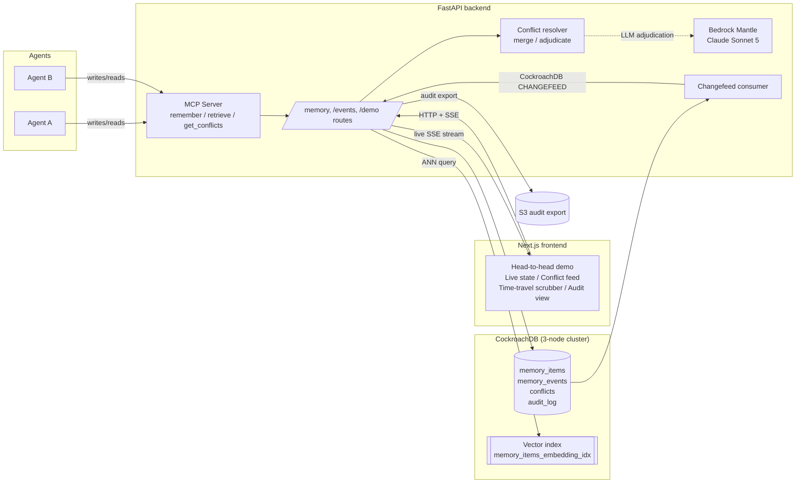

# Quorum

A CockroachDB-backed shared memory layer for multi-agent systems. Concurrent writes are detected and resolved, never silently lost.

Built for the CockroachDB x AWS "Build with Agentic Memory" hackathon.

- **Live demo:** https://quorum.18.206.130.120.sslip.io
- **Video walkthrough:** TBD
- **Repo:** https://github.com/calderbuild/quorum

## The problem

Every popular agent-memory store (Mem0, Zep, Letta-style recall, or a bare vector DB) has no answer for concurrent writes. Agent A and agent B both read the current fact, both decide to write a new one, and whichever write lands last silently wins. The other write vanishes with no error, no trace, and no way to know a conflict ever happened.

`backend/sim/baseline_lww.py` is a faithful, uncharitable implementation of that exact failure mode: it reads the current row, throws the read away, and does an unconditional upsert. Race two writers against it and you lose one of the two facts with zero signal that anything went wrong.

Quorum's answer: every write goes through CockroachDB SERIALIZABLE isolation with an explicit optimistic version CAS (`UPDATE memory_items SET ... WHERE version = $N`). A concurrent write is never silently overwritten. It's detected as a `ConflictDetected`, routed to policy-driven resolution (deterministic merge, or LLM adjudication), and both the losing and winning values stay queryable in the event history.

This is proven live, not asserted. The head-to-head demo runs the identical concurrent-write workload against both paths in the same request and shows the two outcomes side by side: baseline silently drops one agent's fact, Quorum detects the conflict and resolves it with both values recoverable.

## How it works

Two agents write conflicting facts to the same key at the same time.

**Naive baseline** (read-modify-write, no version check): the SELECT result is read and discarded; the write is an unconditional upsert. Whichever transaction commits second wins outright. No error, no conflict record, no trace of the lost fact.

**Quorum**: the write path reads the row's `version`, then issues `UPDATE ... WHERE id = $1 AND version = $2`. If a concurrent writer already bumped the version, the CAS matches zero rows. The losing writer re-reads the current row and raises `ConflictDetected` instead of retrying blindly. An earlier version of this code auto-retried on CockroachDB's SerializationFailure and reproduced the exact same lost-update bug; that's recorded in `app/memory/write.py`'s docstring as the reason it doesn't anymore. The conflict is then handed to one of two resolution policies:

- **merge**: deterministic, offline, no LLM. Concatenates both values, each tagged with its provenance agent. Nothing is discarded.
- **adjudicate**: a real LLM (or a length-heuristic in offline/sim mode) picks or synthesizes a single resolved value. Even here, both candidate values are persisted verbatim in the conflict record, so the "losing" fact is demoted from being the current value, never deleted.

Every write, conflict, and resolution is an immutable row in an append-only `memory_events` table, which is what powers time-travel (reconstruct any item's state at a past timestamp or version), rollback (CAS-guarded, so a rollback can itself lose a race safely), and the audit trail.

## Architecture



## Tools used

### CockroachDB

- **MCP Server** (`backend/app/mcp/server.py`): exposes `remember`, `retrieve`, and `get_conflicts` as MCP tools over stdio, so any MCP-capable agent (Claude Desktop, etc.) reads and writes through the exact same CAS-guarded path as the HTTP API. A `remember` call that loses a race doesn't come back as an MCP error; it comes back as a structured `{status: conflict, current: ...}` payload the calling agent can act on.
- **Distributed vector indexing**: `memory_items.embedding` is a native `VECTOR(128)` column backed by `CREATE VECTOR INDEX memory_items_embedding_idx ON memory_items (embedding)`. Retrieval runs `ORDER BY embedding <-> $query LIMIT k` for scoped ANN search.
- **SERIALIZABLE isolation + optimistic CAS**: every write and rollback happens inside a SERIALIZABLE transaction with a version-guarded `UPDATE ... WHERE version = $N`. Two independent guards catch a race: the CAS itself (zero rows updated), and CockroachDB's own serializable-snapshot-isolation abort (SQLSTATE 40001), which the write path catches explicitly rather than retrying.
- **Native CHANGEFEED**: `backend/app/changefeed/consumer.py` runs `CREATE CHANGEFEED FOR TABLE memory_items, memory_events, conflicts WITH updated` over a dedicated connection and streams it out as Server-Sent Events, so the frontend's live conflict feed is rangefeed-driven push, not a poll loop.

### AWS

- **Bedrock**: `backend/app/llm/adjudicate.py`'s `bedrock` branch uses the Anthropic SDK against AWS's Bedrock Mantle endpoint (`bedrock-mantle.<region>.api.aws/anthropic`), authenticated with a Bedrock-issued API key, calling `anthropic.claude-sonnet-5` for the `adjudicate` conflict-resolution policy. This is code-complete and was confirmed live-authenticated against the real API (same request that eventually returns AWS's own account-level model-access response). Full model inference on this account is pending AWS's Anthropic-model entitlement approval, which is an account configuration step, not a code path. Flipping `QUORUM_MODE=bedrock` requires no further code changes once access is granted.
- **S3**: `POST /events/audit-export` writes the full audit trail (or a single item's history) to S3 as JSON via `export_audit_trail_to_s3`, live-verified against `s3://quorum-hackathon-audit-458443189848`.
- **EC2**: the full stack (3-node CockroachDB, backend, frontend, Caddy reverse proxy) is containerized and deployed to a single EC2 instance behind an IAM instance role scoped to the S3 bucket above. No static AWS keys sit on the box.

## Running it locally

```bash
git clone https://github.com/calderbuild/quorum.git
cd quorum
cp .env.template backend/.env   # QUORUM_MODE=sim works with zero keys
docker compose up -d
```

- Frontend: http://localhost:3000
- Backend: http://localhost:8000
- CockroachDB admin UI: http://localhost:8080

To run the backend or frontend outside Docker, or run the test suite:

```bash
cd backend && python -m venv .venv && source .venv/bin/activate
pip install -r requirements.txt
pytest   # 29/29 passing in sim mode, no external keys needed
```

Set `QUORUM_MODE=openai` or `QUORUM_MODE=bedrock` in `backend/.env` (with the matching API key) for real embeddings and LLM adjudication instead of the deterministic offline sim backend.

## Deploying (the public demo)

```bash
cp .env.template .env   # repo root; fill in DOMAIN, API_DOMAIN, NEXT_PUBLIC_API_URL
docker compose --profile prod up -d
```

The `prod` profile additionally starts Caddy, which reverse-proxies `DOMAIN` to the frontend and `API_DOMAIN` to the backend and auto-issues Let's Encrypt certificates for both, so `DOMAIN`/`API_DOMAIN` need to be real, publicly resolvable hostnames (not `localhost`).

## Repo layout

```
quorum/
  docker-compose.yml       # 3-node CockroachDB + backend + frontend + Caddy (prod profile)
  infra/crdb/init.sql      # schema: memory_items, memory_events, conflicts, audit_log, agents
  backend/
    app/
      memory/write.py      # remember(), the CAS-guarded write path
      memory/retrieve.py   # vector ANN retrieval
      conflicts/resolver.py # merge / adjudicate policies
      llm/adjudicate.py    # sim / openai / bedrock adjudication backends
      llm/embeddings.py    # sim / openai / bedrock embedding backends
      changefeed/consumer.py # CockroachDB CHANGEFEED -> SSE
      events/timetravel.py # time-travel query + rollback
      events/audit.py      # audit trail + S3 export
      mcp/server.py         # MCP tools: remember / retrieve / get_conflicts
      api/                  # FastAPI routers
      demo/head_to_head.py  # baseline-vs-quorum race
    sim/baseline_lww.py     # the naive lost-update baseline
    tests/
  frontend/                 # Next.js: head-to-head demo, live state, time-travel, audit UI
```

## Testing this claim yourself

The fastest way to see the thesis: `docker compose up -d`, open http://localhost:3000, click "Run the race." The naive baseline column shows one agent's write silently overwritten with no trace. The Quorum column shows the conflict detected, both values merged, and the full event history underneath.
